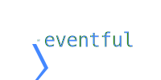

Easy Eventful Asynchronous Scripting with PowerShell
----------------

### Getting Started with Eventful

Eventful is a PowerShell module that helps you use events to script asynchronously.

It gives you an easy syntax to describe events handlers in PowerShell, and provides a platform to build custom event sources.

You can watch for events to occur with Watch-Event.
Watch-Event is aliased to "On".  For example:

~~~PowerShell
# Run in a second
Watch-Event Delay "00:00:01" { "In A Second!" | Out-Host }

# Or, using the alias 'On'
on delay "00:05:00" { "Five more minutes!" | Out-Host}
~~~

These example use the built-in event source script 'Delay'.

Eventful gives you a way to write scripts that will produce events.  These are event sources.

Eventful ships with several event sources.  To see what event sources are available to you, run:

~~~PowerShell
Get-EventSource  # See event sources
~~~

Each event source discovered when Eventful loads creates a smart alias that makes it easier to discover parameters, for example:

~~~PowerShell
# Run in 30 seconds
On@Delay "00:00:30" { "This Message Will Self-Destruct in 30 seconds" | Out-Host }

# Run at 5:00 PM
On@Time "5:00 PM" { "End Of Day!" | Out-Host }

# Run every 2 minutes
On@Repeat "00:02:00" { "Every other minute" | Out-Host }

# Run whenever a file changes within the current directory
On@FileChange { "Files Changed:$($event.SenderEventArgs)" | Out-Host } 
~~~

Eventful also allows you to handle an arbitrary signal.
In the example below, we set up a handler for "MySignal", and the use the alias send to Send-Event(s).

~~~PowerShell
On MySignal {"Fire $($event.MessageData)!" | Out-Host }

# Send-Event can accept pipeline input for MessageData, and will not output unless -PassThru is specified.
1..3 | Send MySignal
~~~

---

[Understanding Event Sources](Understanding_Event_Sources.md)
